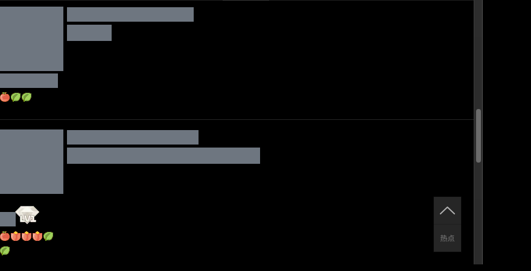
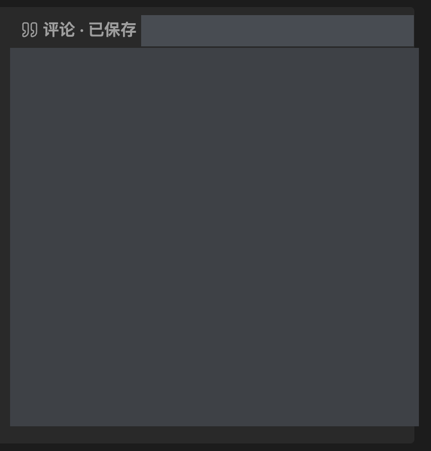

# QQ 空间 → Obsidian 归档技能

把自己的 QQ 空间日志、说说和留言板，整理成能在 Obsidian 阅读的本地笔记：保留图文顺序、将可预览图片下载到本地、区分主评论与楼内回复，并提供数量核验清单。

**通用归档流程，Hermes 已验证。** 本项目以 Hermes Agent 的流程型 Skill 交付，不是独立爬虫或 Obsidian 插件。归档规则可以复用到其他平台，但浏览器、文件和凭据工具需要对应适配。ChatGPT 与 WorkBuddy 已补充基于官方文档的操作建议，尚未完成本项目的端到端验证。

[效果预览](#效果预览) · [平台选择与使用方法](docs/PLATFORMS.md) · [下载安装](#下载安装) · [开始使用](#开始使用) · [完整指南](docs/USAGE.md) · [隐私与限制](docs/PRIVACY.md) · [常见问题](docs/FAQ.md)

> [!IMPORTANT]
> 当前仓库用于私有审核，尚未公开。示例截图保留经检查的普通正文，头像、名字、日期及其他个人信息已遮盖。仓库不包含任何人的完整归档、原始私人截图、Cookie、密码或浏览器配置。

## 能做什么

| 能力 | 输出与边界 |
| --- | --- |
| 日志、说说、留言板 | 日志逐篇保存，说说与留言可按年份整理；不把好友动态误当作本人内容 |
| 图文顺序 | 按原始 HTML 顺序转换，保留段落、换行与图片位置，不承诺像素级复刻 |
| 本地图片与表情 | 实际解码后才保存；按哈希去重，保留 GIF 动画；失效图片记录跳过原因 |
| 评论与楼内回复 | 从 DOM 层级提取作者、时间、正文和归属关系，不将整页文本混成一段 |
| 折叠阅读 | Obsidian Callout 收起评论与元信息，正文保持简洁 |
| 可核验 | 分批保存 JSON、按 ID 去重、核对数量、检查图片引用与缺失条目 |
| 时间保真 | 原页只显示日期就只保存日期，不补造时间、年份或时区 |

## 平台选择

| 平台 | 推荐方式 | 本项目验证状态 |
| --- | --- | --- |
| Hermes | 安装本仓库 Skill，通过浏览器与文件工具执行 | macOS 真实案例已验证 |
| ChatGPT 普通 Chat | 提供少量已导出资料，按规则整理 Markdown | 未实测全流程；不等于获得本地 Vault / QQ 登录权限 |
| ChatGPT Work | 按实际浏览器与文件权限先做小样本；云端结果下载后导入 Vault | 官方有执行能力，本项目 QQ 兼容性未验证 |
| WorkBuddy | 使用“创建技能”入口适配规则，再检查工具和权限 | 官方有技能入口，本项目导入/归档未实测 |

详细操作、可复制指令、工具适配和官方依据见 [跨平台使用指南](docs/PLATFORMS.md)。**以下安装脚本与技能目录只针对 Hermes，不是其他平台的通用安装器。**

## 效果预览

以下均为**真实页面的局部脱敏截图**，不是虚构的内容展示。头像、名字、日期已用不透明块遮盖；经过检查的普通正文保留可读，例如“其实这种生活更累”“确实累啊”。涉及个人工作、地点和其他身份信息的片段不选入截图。截图展示同一段原评论在 QQ 空间与 Obsidian 中的真实排版。

### QQ 空间原页面局部



### Obsidian 评论容器局部



这张 Obsidian 截图是展开状态的历史实际效果，不能作为最新解析结果的验收证据。生成笔记使用下列原生折叠语法，`-` 表示默认收起；在 Obsidian 阅读视图点击标题可展开。

```markdown
> [!quote]- 评论
> **评论作者 · 原页显示时间**
> 主评论正文
>
> > [!note]- 楼内回复
> > **回复作者 · 原页显示时间**
> > 回复正文
```

上面的文字仅为**格式占位示例**，不来自真实私人文章。

## 下载安装

### 前置条件

- 已安装并能正常调用模型和浏览器工具的 [Hermes Agent](https://hermes-agent.nousresearch.com/docs/)。
- 已安装 Obsidian，且知道目标 Vault 的实际路径。
- 拥有目标 QQ 空间的合法访问权限，可以自行完成 QQ 扫码登录。
- 使用安装脚本需要 Python 3.9+；手动复制 Skill 不需要额外安装 Python。
- 图片下载校验使用 Pillow，是否可用由执行归档的 Hermes 环境检查；安装脚本本身仅使用标准库。

### 方法一：下载 ZIP，手动安装

1. 在仓库页面点击 **Code → Download ZIP**，解压。
2. 找到 `qzone-archive` 文件夹，里面应有 `SKILL.md`。
3. 将**整个文件夹**放到当前 Hermes profile 的 `skills` 目录：
   - 默认 profile：`~/.hermes/skills/qzone-archive/SKILL.md`。
   - Windows 默认位置：`%USERPROFILE%\.hermes\skills\qzone-archive\SKILL.md`。
   - 自定义 `HERMES_HOME` 或其他 profile：使用该 profile 的实际 `skills` 目录，不要复制到其他 profile。
4. 若目标已存在，先备份并人工比较，不要直接覆盖。
5. 新开 Hermes 会话，要求加载 `qzone-archive`。

私有审核期间，只有获授权的 GitHub 账号能下载；尚未公开时无法向所有人提供匿名下载。

### 方法二：Git + 安装脚本

```bash
git clone https://github.com/fea110/qzone-archive-skill.git
cd qzone-archive-skill
python3 scripts/install.py --dry-run
python3 scripts/install.py
```

Windows 如无 `python3`，使用 `py -3` 或 `python`。脚本默认使用 `HERMES_HOME/skills`，未设置时使用用户主目录下的 `.hermes/skills`。**先检查 dry-run 显示的路径。**

为指定 profile 安装：

```bash
python3 scripts/install.py --skills-dir "/path/to/your/profile/skills" --dry-run
python3 scripts/install.py --skills-dir "/path/to/your/profile/skills"
```

脚本不会覆盖已存在的 Skill，也不会修改配置、模型、凭据或 Obsidian 笔记。详细说明见 [安装指南](docs/INSTALL.md)。

## 开始使用

安装后，在 Hermes 新会话里发送：

```text
加载 qzone-archive，把我自己的 QQ 空间归档到我的 Obsidian Vault。
目标 Vault：填写你的实际路径。
范围：日志、说说、留言板。
可正常预览的图片和表情请下载到本地，保持原有图文顺序。
主评论和楼内回复分别保存，评论默认折叠。
请先确认归档范围与输出目录，再开始；QQ 登录由我自行完成。
完成后核对来源条数、去重条数、图片引用和跳过项目，并说明尚未核验的部分。
```

不要把 QQ 密码、验证码、Cookie 或 API Key 发到聊天里。二维码过期时让 Hermes 刷新后再扫码。

## 归档目录

```text
QQ空间归档-<空间标识>/
├── 索引.md
├── 日志/             # 每篇一份 Markdown
├── 说说/             # 可按年份分组
├── 留言板/           # 可按年份分组
├── 附件/             # 已验证的本地图片/表情
└── 原始数据/         # JSON、图片清单、核验清单
```

此目录由 Hermes 在授权位置生成，**不会作为本项目的一部分发布**。原始 JSON、原文链接与附件可能包含私人信息，本地文件默认没有加密。

## 限制与已验证范围

- 流程已用于 macOS 上的真实归档工作；安装脚本在本项目中有本地测试。Windows/Linux 归档全过程尚未验证。
- QQ 空间 DOM 和分页行为可能变化，选择器必须在实际页面确认。
- 仅能归档当前账号实际可访问、页面实际显示的内容。折叠或未加载的回复不能直接声称完整。
- 日志评论主楼与楼内回复的结构提取经过真实案例验证；说说与留言板回复仍须逐页核验，不能沿用日志结果宣称全站已验证。
- 私密日记、草稿、回收站、相册、视频和音频不在默认范围，不能擅自扩大采集。
- 无法预览或返回占位图的图片会跳过；保存在线链接不等于离线备份。
- Skill 是执行规则，不保证所有模型或所有页面都能一次完成；必须以核验结果为准。

## 开发与检查

```bash
python3 -m unittest discover -s tests -v
```

测试覆盖安装、已存在目标保护、dry-run 和 profile 路径选择；不进行 QQ 网络采集。提交 Issue 请先脱敏，不要上传私人归档或登录资料。

## 文档结构参考

README 的信息组织参考国内/中文开发者社区的高星项目：[RSSHub](https://github.com/DIYgod/RSSHub)、[ChatTTS](https://github.com/2noise/ChatTTS)、[Cherry Studio](https://github.com/CherryHQ/cherry-studio)。借鉴的是入口、功能、截图、快速开始和分层文档结构，没有复制其截图或宣称合作。详见 [参考说明](docs/REFERENCES.md)。

## 许可证

项目规则、文档与安装脚本使用 [MIT License](LICENSE)。QQ 空间内容与第三方图片的权利仍属于原作者；MIT 不授予他人私人内容的使用权。
